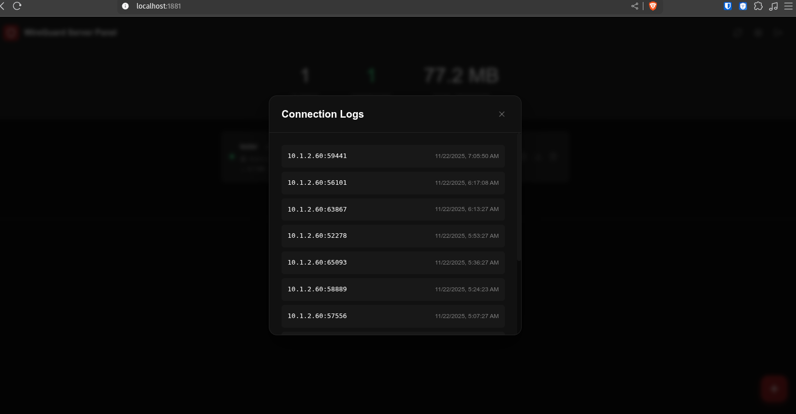
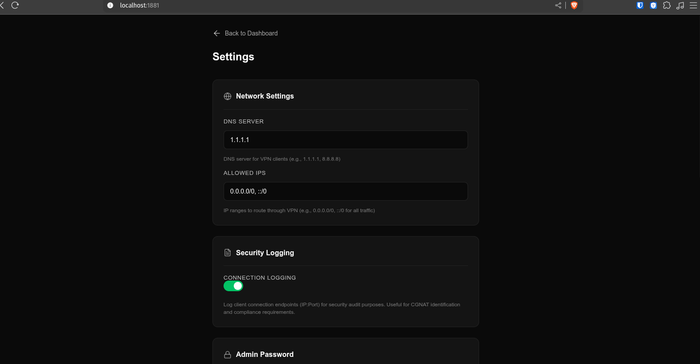

# WireGuard Panel

Modern, lightweight WireGuard VPN management panel. Single Docker container with everything included.

[](https://hub.docker.com/r/layerweb/wireguard-panel)
[](LICENSE)

## Screenshots

| Login | Dashboard |
|:---:|:---:|
|  |  |

| QR Code | Connection Logs |
|:---:|:---:|
|  |  |

| Settings | API & Tailscale |
|:---:|:---:|
|  |  |

## Features

- **Easy Setup**: Single command deployment
- **Client Management**: Create, edit, delete VPN clients
- **QR Codes**: Scan with WireGuard mobile app
- **Real-time Stats**: Transfer, handshake, online status
- **Enable/Disable**: Toggle clients without deleting
- **Config Download**: Direct .conf file download
- **Dark Mode UI**: Professional WireGuard themed interface
- **API Token**: Permanent token for automation (changes only with password)
- **Connection Logging**: Optional endpoint logging for security audit
- **Tailscale Integration**: Route WireGuard clients to Tailscale network

## Requirements

- Docker
- Port 1881 available (TCP for panel, UDP for VPN)
- Linux host with kernel 5.6+ (or wireguard-dkms)

## Quick Start

### Option 1: Docker Run (Recommended)

```bash
docker run -d \
  --name wireguardpanel \
  --cap-add NET_ADMIN \
  --cap-add SYS_MODULE \
  --sysctl net.ipv4.ip_forward=1 \
  --sysctl net.ipv4.conf.all.src_valid_mark=1 \
  --device /dev/net/tun:/dev/net/tun \
  -p 1881:1881/tcp \
  -p 1881:51820/udp \
  -v wireguard-data:/data \
  -e ADMIN_PASSWORD=your_secure_password \
  --restart unless-stopped \
  layerweb/wireguard-panel:latest

# View logs
docker logs -f wireguardpanel
```

### Option 2: Docker Run with Local Directory

```bash
# Create data directory
mkdir -p ./data

# Run container
docker run -d \
  --name wireguardpanel \
  --cap-add NET_ADMIN \
  --cap-add SYS_MODULE \
  --sysctl net.ipv4.ip_forward=1 \
  --sysctl net.ipv4.conf.all.src_valid_mark=1 \
  --device /dev/net/tun:/dev/net/tun \
  -p 1881:1881/tcp \
  -p 1881:51820/udp \
  -v $(pwd)/data:/data \
  -e ADMIN_PASSWORD=your_secure_password \
  --restart unless-stopped \
  layerweb/wireguard-panel:latest
```

### Option 3: Docker Compose

```bash
# Clone repository
git clone https://github.com/layerweb/wireguard-server-panel.git
cd wireguard-server-panel

# Start container
docker compose up -d

# View logs
docker compose logs -f
```

Panel will be available at: `http://YOUR_SERVER_IP:1881`

**Default credentials:**
- Username: `layerweb`
- Password: `admin` (or your ADMIN_PASSWORD)

## Configuration

### Environment Variables

```bash
# Server IP (auto-detected if empty)
WG_HOST=

# VPN Network
WG_NETWORK=10.8.0.0/24
WG_DNS=1.1.1.1

# Admin Password
ADMIN_PASSWORD=your_secure_password

# Timezone
TZ=Europe/Istanbul
```

### Ports

| Port | Protocol | Description |
|------|----------|-------------|
| 1881 | TCP | Web Panel |
| 1881 | UDP | WireGuard VPN |

### Data Persistence

All data is stored in a single `/data` volume:

```
/data/
├── wireguard/     # WireGuard keys and config
│   └── wg0.conf
├── db/            # SQLite database
│   └── wireguard.db
└── tailscale/     # Tailscale state (optional)
    └── tailscaled.state
```

## Usage

### Creating a Client

1. Click the **+** button
2. Enter client name (e.g., "Phone", "Laptop")
3. Click **Create**
4. Download config or scan QR code

### Managing Clients

- **Edit**: Click pencil icon to rename
- **Enable/Disable**: Click power button
- **QR Code**: Click QR icon
- **Download**: Click download icon
- **Delete**: Click trash icon

### API Access

Get your API token from Settings page. Use it for automation:

```bash
# List all peers
curl -X GET "http://YOUR_SERVER:1881/api/v1/peers" \
  -H "Authorization: Bearer YOUR_API_TOKEN"

# Create new peer
curl -X POST "http://YOUR_SERVER:1881/api/v1/peers" \
  -H "Authorization: Bearer YOUR_API_TOKEN" \
  -H "Content-Type: application/json" \
  -d '{"name": "My Phone"}'

# Delete peer
curl -X DELETE "http://YOUR_SERVER:1881/api/v1/peers/10.8.0.2" \
  -H "Authorization: Bearer YOUR_API_TOKEN"
```

## Tailscale Integration

Connect your WireGuard clients to your Tailscale network. This allows WireGuard clients to access Tailscale subnets and peers without installing Tailscale.

### Setup

1. Go to **Settings** page in the panel
2. Click **Connect to Tailscale**
3. Copy the auth URL and open it in your browser
4. Authenticate with your Tailscale account
5. Enable **Route WireGuard to Tailscale** toggle

### How it works

When routing is enabled, iptables rules route WireGuard traffic through the Tailscale interface:

```bash
# Traffic from WireGuard clients to Tailscale network
iptables -t nat -A POSTROUTING -s 10.8.0.0/24 -o tailscale0 -j MASQUERADE
iptables -A FORWARD -i wg0 -o tailscale0 -j ACCEPT
iptables -A FORWARD -i tailscale0 -o wg0 -m state --state RELATED,ESTABLISHED -j ACCEPT
```

Your WireGuard clients can now access:
- Tailscale peers (100.x.x.x addresses)
- Subnet routes advertised by other Tailscale nodes

### Use Cases

- Access home network devices through WireGuard
- Share Tailscale resources with users who can't install Tailscale
- Route traffic to specific subnets via Tailscale exit nodes

## Advanced Configuration

### Custom Ports

```bash
docker run -d \
  --name wireguardpanel \
  --cap-add NET_ADMIN \
  --cap-add SYS_MODULE \
  --sysctl net.ipv4.ip_forward=1 \
  --sysctl net.ipv4.conf.all.src_valid_mark=1 \
  --device /dev/net/tun:/dev/net/tun \
  -p 8080:1881/tcp \
  -p 51820:51820/udp \
  -v wireguard-data:/data \
  -e WG_PORT=51820 \
  -e PANEL_PORT=1881 \
  -e ADMIN_PASSWORD=your_password \
  --restart unless-stopped \
  layerweb/wireguard-panel:latest
```

### Behind Reverse Proxy (nginx)

```nginx
server {
    listen 443 ssl;
    server_name vpn.yourdomain.com;

    location / {
        proxy_pass http://localhost:1881;
        proxy_set_header Host $host;
        proxy_set_header X-Real-IP $remote_addr;
    }
}
```

### Custom Network Range

```bash
-e WG_NETWORK=10.100.0.0/24
```

Supports up to 253 clients per /24 network.

## Commands

```bash
# Start
docker start wireguardpanel

# Stop
docker stop wireguardpanel

# Restart
docker restart wireguardpanel

# View logs
docker logs -f wireguardpanel

# Shell access
docker exec -it wireguardpanel bash

# WireGuard status
docker exec wireguardpanel wg show

# Check health
curl http://localhost:1881/api/health
```

## Backup & Restore

### Backup

```bash
# Using Docker volume
docker run --rm -v wireguard-data:/data -v $(pwd):/backup alpine \
  tar czvf /backup/wireguard-backup.tar.gz -C /data .

# Using local directory
tar -czvf wireguard-backup.tar.gz data/
```

### Restore

```bash
# Using Docker volume
docker run --rm -v wireguard-data:/data -v $(pwd):/backup alpine \
  sh -c "cd /data && tar xzvf /backup/wireguard-backup.tar.gz"

# Using local directory
tar -xzvf wireguard-backup.tar.gz
```

## Troubleshooting

### Container won't start

Check logs:
```bash
docker logs wireguardpanel
```

Common issues:
- Port 1881 already in use
- Missing NET_ADMIN capability
- Kernel doesn't support WireGuard

### Clients can't connect

1. Check firewall allows UDP 1881
2. Verify WireGuard is running: `docker exec wireguardpanel wg show`
3. Check client config has correct endpoint

### Reset admin password

```bash
# Stop container
docker stop wireguardpanel

# Remove database (keeps WireGuard config and peers)
docker run --rm -v wireguard-data:/data alpine rm /data/db/wireguard.db

# Start (creates new admin with default password)
docker start wireguardpanel
```

## Security Notes

- Change default admin password immediately
- Use HTTPS via reverse proxy for production
- JWT secrets are auto-generated on each start
- API token is derived from password (43 characters, constant unless password changes)
- Private keys stored encrypted in database
- Rate limiting on login endpoint

## Architecture

```
┌─────────────────────────────────────┐
│         Docker Container            │
├─────────────────────────────────────┤
│  ┌─────────────┐  ┌──────────────┐  │
│  │   Go API    │  │  React UI    │  │
│  │  (Gin)      │  │  (Vite)      │  │
│  └──────┬──────┘  └──────────────┘  │
│         │                           │
│  ┌──────▼──────┐  ┌──────────────┐  │
│  │   SQLite    │  │  WireGuard   │  │
│  │  Database   │  │   Server     │  │
│  └─────────────┘  └──────────────┘  │
└─────────────────────────────────────┘
```

## Building from Source

```bash
# Clone repository
git clone https://github.com/layerweb/wireguard-server-panel.git
cd wireguard-server-panel

# Build image
docker build -t wireguardpanel .

# Run
docker run -d \
  --name wireguardpanel \
  --cap-add NET_ADMIN \
  --cap-add SYS_MODULE \
  --sysctl net.ipv4.ip_forward=1 \
  --sysctl net.ipv4.conf.all.src_valid_mark=1 \
  --device /dev/net/tun:/dev/net/tun \
  -p 1881:1881/tcp \
  -p 1881:51820/udp \
  -v wireguard-data:/data \
  -e ADMIN_PASSWORD=admin \
  --restart unless-stopped \
  wireguardpanel
```

## License

MIT License

## Credits

Inspired by [wg-easy](https://github.com/wg-easy/wg-easy)
